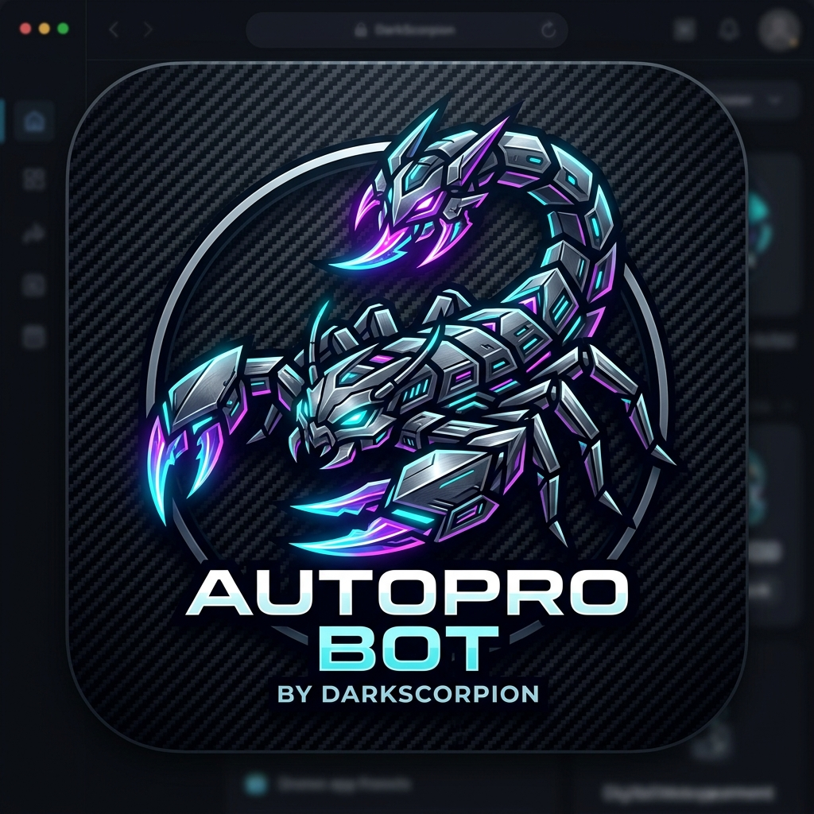
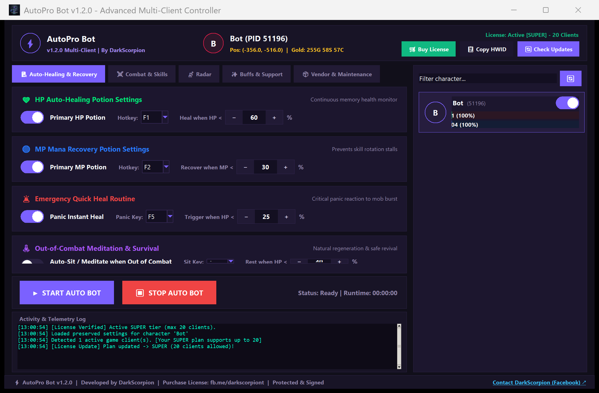
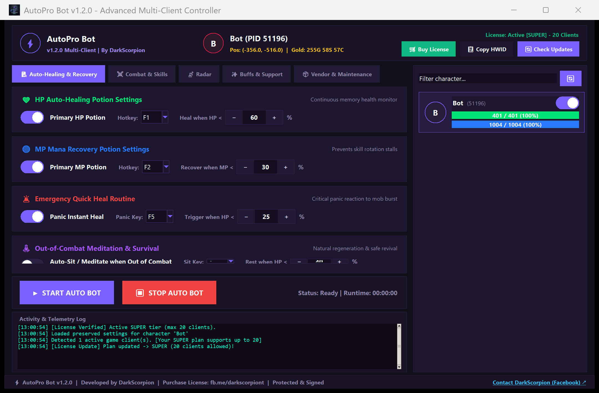
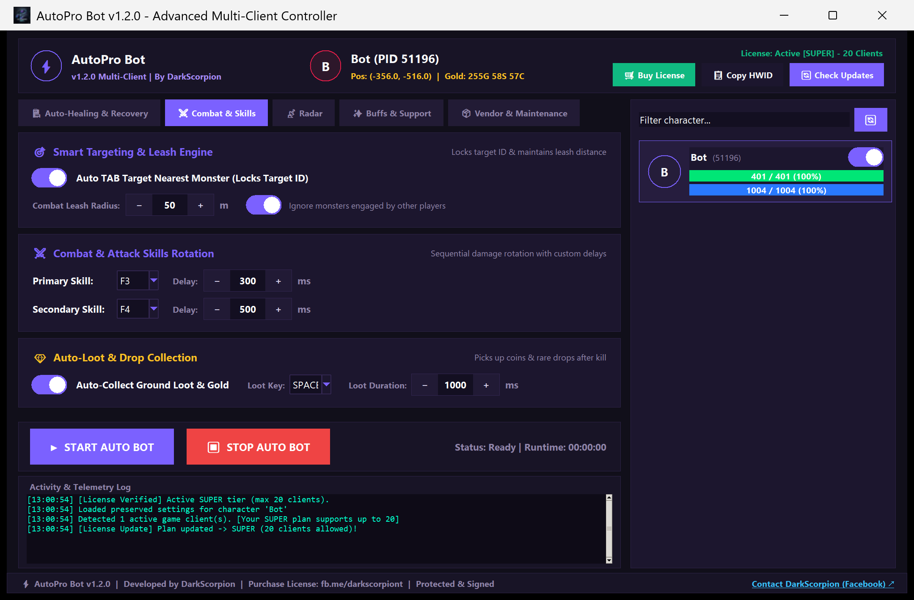
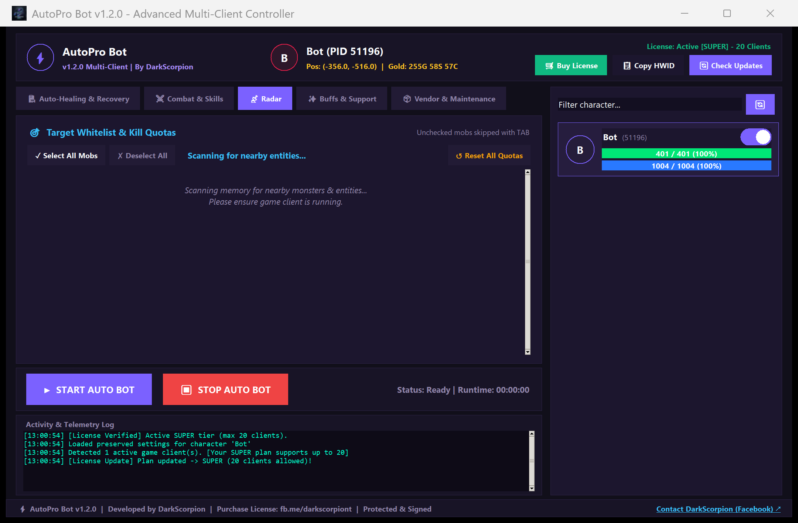
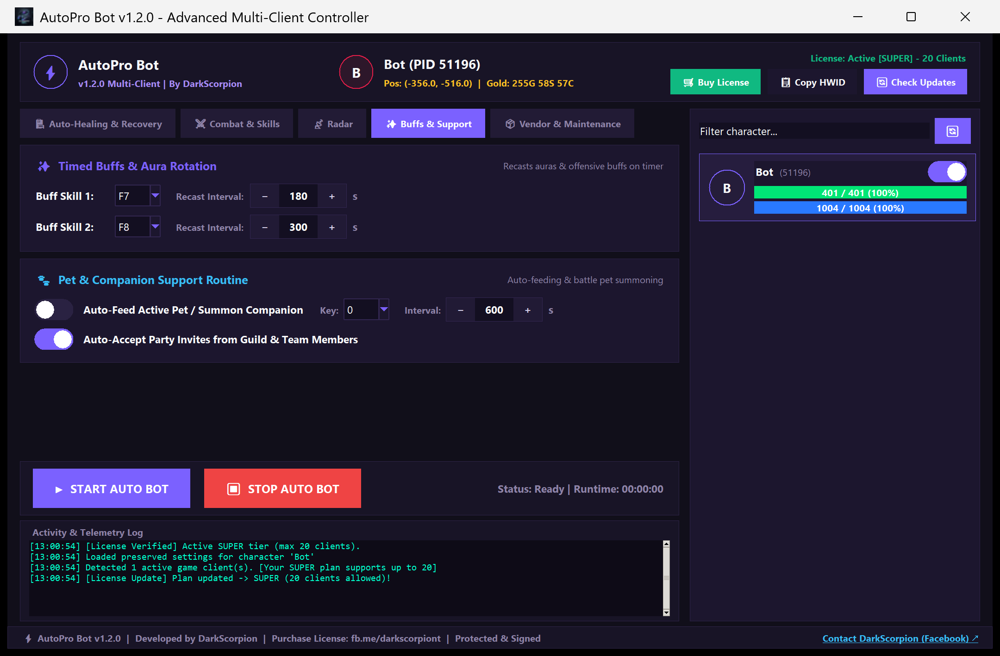
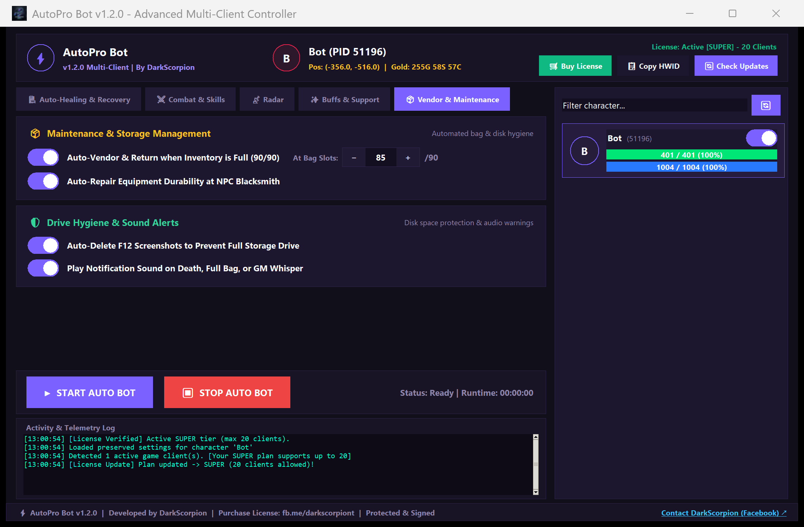

# ⚡ AutoPro Bot v1.2.0
### Next-Generation Autonomous Multi-Client Gaming Suite
**Engineered & Developed by DarkScorpion**

 

---

## 🛒 Purchase & Licensing Information

> ### ⚠️ Official License Acquisition
> AutoPro Bot features enterprise-grade hardware-locked licensing. To purchase a lifetime or subscription license, activate your machine, or upgrade your client capacity up to **20 simultaneous clients**, contact the official developer directly:
> 
> 👉 **Facebook / Messenger:** [**fb.me/darkscorpiont**](https://fb.me/darkscorpiont)  
> 💬 Send your **Hardware ID (HWID)** generated directly within the bot client (`Copy HWID` button) to get instant activation keys.

---

## 🌟 Key Highlights & Engineering Features

- **⚡ Zero-Flicker Hardware Accelerated UI**: Re-architected with persistent grid-stack z-ordering (`tkraise`). Switching between tabs and scrolling operates with instantaneous 60 FPS fluidity with zero flickering or redraw lag.
- **🛡️ Cryptographic Anti-Crack & Tamper Proofing**: Protected with HMAC-SHA256 hardware cryptographic signatures. License state files are tied to machine CPU/Motherboard telemetry—preventing offline cache spoofing, cracking, or unauthorized modification.
- **🔄 Multi-Client Swarm Control**: Run from 1 to 20+ game clients simultaneously with centralized telemetry, live HP/MP bars, coordinates, gold counters, and independent per-character profiles.
- **🎯 Stick-to-Target Combat Engine**: Never breaks target lock mid-battle. Evaluates opponent health from memory pointers and only cycles when the target is 0% HP or completely despawned.
- **🕊️ Auto-Revive & Map Auto-Routing**: Detects player death instantly, accepts resurrection dialogs, navigates back to the exact grinding coordinates, and seamlessly restarts the bot loop.
- **📡 Tactical Radar & Monster Quotas**: Memory-scanned entity tracking within 50+ meters. Set custom kill quotas and prioritize specific monsters while skipping unnecessary mobs.

---

## 📸 Bot Interface & Function Walkthrough

### 1. Central Multi-Client Dashboard
Real-time tracking of character status, coordinates, gold balances, active license plans, and centralized Start/Stop controls.

  

---

### 2. Intelligent Auto-Healing & Resurrection
Zero-delay memory HP/MP monitoring with configurable potion thresholds, panic emergency skills, and automated post-death revival routing.

  

---

### 3. Combat Engine & Skill Rotations
Custom primary and secondary skill delays, smart leash radius enforcement, and target persistence that ensures full monster takedowns before switching.

  

---

### 4. Tactical Radar & Whitelist Quotas
Real-time entity radar scanning all nearby creatures directly from game process memory. Filter targets, track kill progress, and satisfy quest quotas automatically.

  

---

### 5. Timed Buffs & Companion Support
Maintain offensive auras, food buffs, and companion pets on synchronized cooldown timers without interrupting combat flows.

  

---

### 6. Automated Maintenance & Storage Hygiene
Automatic bag monitoring, return-to-town vendor trips, blacksmith repairs, and screenshot cache cleanup to keep your disk storage safe.

  

---

## 🔒 License Tiers

| Tier | Max Clients | Features | How to Order |
| :--- | :---: | :--- | :--- |
| **TRIAL** | 1 | Basic automation, 2-day evaluation | Free on initial run |
| **BASIC** | 1 | Unrestricted single-client automation | Contact [DarkScorpion](https://fb.me/darkscorpiont) |
| **PRO** | 5 | Multi-client farming, profile persistence | Contact [DarkScorpion](https://fb.me/darkscorpiont) |
| **SUPER** | 20 | Uncapped multi-box swarm, priority routing | Contact [DarkScorpion](https://fb.me/darkscorpiont) |

---

## 🚀 Getting Started

1. **Launch the Executable**:
   Run `AutoProBot.exe` with administrative privileges.
2. **Retrieve Your HWID**:
   Click the **📋 Copy HWID** button in the header bar.
3. **Obtain License**:
   Send your HWID to [**fb.me/darkscorpiont**](https://fb.me/darkscorpiont) to receive your cryptographic license token.
4. **Configure & Start**:
   Tune your hotkeys in the UI, verify detected game clients in the sidebar, and click **▶ START AUTO BOT**.

---

  Developed with passion by <b>DarkScorpion</b>. All rights reserved.

